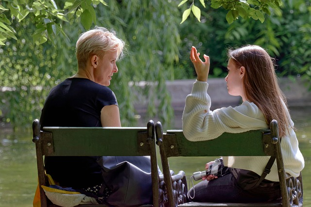
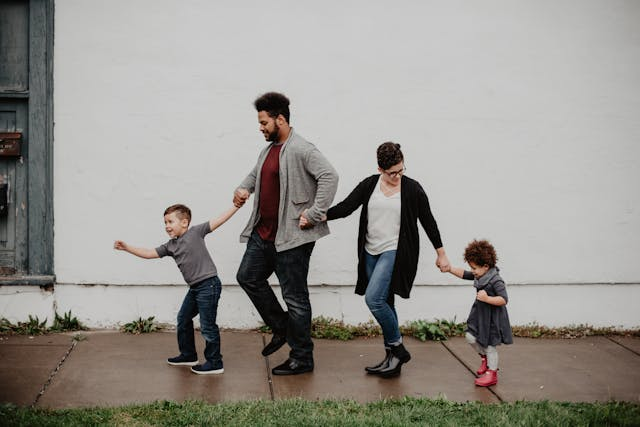
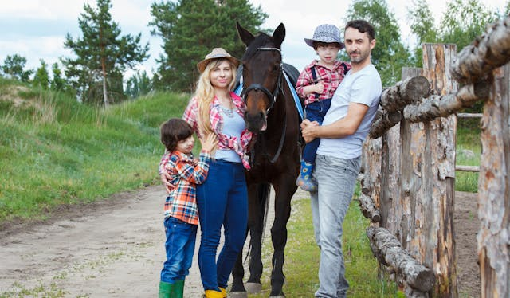

# 1. Guten Tag. Mein Name ist...

>*«Los límites de mi idioma son los límites de mi mundo»* - Ludwig Wittgenstein

## Índice 

* 1.1. **Einführung** (Introducción)
* 1.2. **Grüße** (Saludos)  
  -  Estructura sintáctica
  - Personalpronomen (Pronombres)
* 1.4. **Ich komme aus...**(Vengo de...)
   - Verben (Verbos) 
* 1.5. **Persönliche Angaben** (Datos personales)
* 1.6. **Wortschatz+** (Vocabulario)
---------------

### 1.1 Einführung

Bienvenidos/as a este curso inicial de conversación en alemán. Para comenzar vamos a aprender los saludos básicos (tanto formales como informales) y a cómo presentarnos. Esto se logrará mediante una serie de ejercicios prácticos que serán principalmente por escrito, pero también habrá actividades de escucha a lo largo de la unidad. Teoría y ejercicios irán dados de la mano, de forma que el contenido no se quede en una simple lectura. La clave para avanzar e integrar nueva información es ponerla en prácica de diversas formas. Dicho esto, ¡comencemos!

### 1.2. Gruße
Para iniciar esta sección os propongo que primero visualicéis el siguiente vídeo:

En él se da a conocer algunos de los saludos y formas de presentarse más básicas en la lengua alemana. Ya que es un vídeo introductorio, no se incluyen expresiones gramaticales, pues el objetivo es tomar un primer contacto con la lengua que no produzca grandes dificultades. En [Wortschatz+](#15-wortschatz) tenéis disponible todo el vocabulario mencionado. 

**Achtung!** --> Los ejercicios están señalados con el siguiente sistema: A1, A2. A3, etc.

#### <u>A1. Hören Sie und Sprechen Sie dann Ihrem Namen.</u>

\+ **Guten Tag**. Mein name ist Thomas Rob.  
\- Guten Tag, Herr ... Entschuldigung, **wie heißen Sie?**  
\+ Thomas Rob.  
\- Ah ja. Guten Tag, Herr Rob. **Ich bin Claudia González.**  
\+ Guten Tag, Frau González. 

---

\* Das ist meine Kollegin Frau González.  
\- Guten Tag, Frau González. Herzlich wilkommen.  
\+ Vielen Dank. **Und wer sind Sie?**  
\- Ich bin Monik Strauss.  

Nota: si no entiendes alguna palabra o expresión, y no aparece en el vocabulario, puedes consultarla en [Wordreference.](https://www.wordreference.com/)

#### - Estructura sintáctica
Para ayudarte, quí tienes unas tablas sencillas que te indican el orden de las oraciones afirmativas e interrogativas en alemán. 

1. Aussage (Enunciados afirmativos)
   
| 1         | 2        | 3              |
|-----------|----------|----------------|
| Mein Name | ist      | Irene Barquero |
| Ich       | bin      | Irene          |
| Ich       | komme    | aus Spanien    |
| Sie       | sprechen | Deutsch        |

2. Frage (Preguntas)

| 1     | 2        | 3    |
|-------|----------|------|
| Wer   | ist      | das? |
| Wie   | heißen   | Sie? |
| Woher | kommen   | Sie? |
| Was   | sprechen | Sie? |

#### - Personalpronomen

1. Ich
2. Du
3. Er/Sie/Es (en alemán existe el neutro)
4. Wir
5. Ihr
6. sie/Sie (ellos/usted)
   

  

### 1.4. **Ich komme aus...**
Este apartado se basa en practicar un poco la estructura sintáctica y a aprender cómo decir los nombres de algunos países (en [Wortschatz+](#15-wortschatz) lo puedes consultar). Aquí tienes una tabla inicial con las conjungaciones básicas (1ª, 2ª y 3ª persona). 
Puedes observar como las declinaciones en los verbos regulares (total o parcialmente), se repiten (*-e, -st, -en*), mientras que el verbo irregular *sein* (ser/estar) no sigue esa tendencia. Esto ocurre con varios verbos en alemán, y al igual que en todas las lenguas, no queda otra más que practicarlos hasta interiorizarlos. Lo positivo es que tan solo son unos pocos, como los verbos auxiliares *haben* (tener) y *werden* (llegar a ser/convertise), ¡así que ánimo!
#### Verben
|     | kommen | heißen | sprechen | sein |
|-----|--------|--------|----------|------|
| ich | komm**e**  | heiß**e** | sprech**e** | **bin**  |
| du  | komm**st** | hei**ßt**  | spr**i**ch**st** | **bist** |
| Sie | komm**en** | heiß**en** | sprech**en** | **sind** |
--------
#### <u>A3. Ergänzen Sie.</u>

\- Herr González, woher komm___ Sie?  
\* Aus Spanien.

\* Peter, woher komm___ du?  
\- Aus Österreich.

\*Frau Strauss, woher _______ ____?  
\- Aus der Schweiz. 
####  <u>A4. Hören Sie. Welches Bild passt zu welchen Gespräch?</u>

\* Guten Tag. Meine Name ist Frank Michelson.  
\- Guten Tag. Freut mich. Ich heiße Jenna Wagner. **Woher kommen Sie**, Herr Michelson?  
\* Den USA, aus Oklahoma. 

-------
\* Hallo. Ich bin Mikel. Und wer bist du?  
\- Ich bin Oliver. **Woher kommst du**, Mikel?  
\* Aus Berlin.   

### 1.5. Persönliche Angaben

Finalmente, aquí encontrarás un par de ejercicios de escucha, sencillos, que te ayudarán a afianzar nuevo vocabulario. El objetivo es ampliar brevemente lo aprendido al comienzo de la lección, dando datos como tu nombre, apellidos, dirección, etc. 

#### <u>A2. Hören Sie und ergänzen Sie das Formular.</u>
HOTEL Berlin
----
.jpg)

**GÄSTEINFORMATION**

- Familienname:  
- Vorname:
- Stadt:  
- Straße:
- Land:
  
#### <u>A5. Ergänzen Sie das Formular mit Ihnen Daten.</u>

| Familienname: | ______________ |
|---|---|
| Vorname: | ______________ |
| Strabe, Hausnummer: | ______________ |
| Postleitzahl, Stadt:  | ______________ |

### 1.5. Wortschatz+

| Gruße |  |
|---|---|
| Hallo | Hola |
| Guten Tag / Guten Morgen*      | Buenos días |
| Guten Abend | Buenas tardes |
| Gute Nacht | Buenas noches  |
| Auf Wiedersehen | Adiós (literalmente: "hasta que nos veamos") |
| Tschüs, Bis Bald (+ informal) | Adiós |

* *Guten Morgen* tan solo se usa por la mañana, mientras que *Guten Tag* se puede usar a lo largo de todo el día. 

--------
| Ich stelle mich vor! |  |
|---|---|
| Meine Name **ist** Irene | Mi nombre es Irene |
| Ich **heiße** Irene  | Me llamo Irene |
| Ich **bin** 25 Jahre alt | Tengo 25 años |
| Ich **komme** aus Spanien | Vengo de España/Soy de España |
| Ich **bin** Spanisch | Soy española |
|  |  |
-----
| aus | dem | der | den |
|---|---|---|---|
| Spanien | Iran | Schweiz | USA |
| Deutschland | ... | Türkei | ... |
| England |  | ... |  |
| Italien |  |  |  |
| Österreich |  |  |  |
------------
| Persönliche Angaben | Datos personales  |
|---|---|
| Familienname | Apellido(s)* |
| Vorname | Nombre** |
| Strabe | Calle |
| Hausnummer | Número  |
| Postleitzahl | Código postal |
| Stadt | Ciudad |
| Land  | País  |

\* En Alemania normalmente solo se tiene un apellido.  
\* * Literalmente: "antes del nombre" : *vor + name.* 

# 2. Familie und Freunde 

En esta unidad nos centraremos en aprender a presentar a nuestros familiares y amigos, por lo que necesitarás vocabulario nuevo. También aprenderemos a contar hasta 30. 

## Índice 
* 2.1. **Wie geht's? - Danke, sehr gut** (¿Cómo estás?)
* 2.2. **Das ist mein Freund...** (Presentar a alguien)
* 2.3. **Zahlen** (Números)
* 2.5. **Linken** (Enlaces)
---
### 2.1. Wie geht's? - Danke, sehr gut.

<u>**B1. Ordnen Sie die Emoticons den Sätzen zu.**</u>

|  |  |  |  |  |
|---|---|---|---|---|
| Super! | 😀 |  |  |  |
| Danke, sehr gut. | 😆 |  |  |  |
| Gut, danke. | 🙂 |  |  |  |
| Na ja, es geht. | 😕 |  |  |  |
| Ach, nich so gut. | 😐 |  |  |  |

<u>**B2. Hören Sie und sprechen Sie dann mit Ihren Name.**</u>

a. 

\+ Guten Tag, Herr Müller.  
\- Guten Tag, Herr Arhonen. **Wie geht es Ihnen**?  
\+ Gut, danke. Und **Ihnen**?  
\- Auch gut.  

b.  
\+ Hallo, Corinna.  
\- Hallo, Timo. Na, **wie geht es dir**?  
\+ Danke, sehr gut. Und **dir**?  
\- Super.  

> 💡 ¿Sabes reconocer las diferencias entre ambos diálogos?

⚠️ Recuerda: los pronombres personales en alemán son los siguientes:

| ich |
|---|
| du |
| er/sie |
| wir |
| ihr |
| sie/Sie |

En alemán es muy importante la diferenciación entre el "tú" y el "usted", por lo que debes de analizar la situación antes de dirigirte a alguien. Por norma general, la diferenciación se usa cuando se trata de alguien que no conoces, un superior del trabajo o una persona mayor. 

### 2.2. Das ist mein Freund...

En este apartado aprenderás a hacer referencia a familiares. Es muy importante tener en cuenta el género para poder usar los pronombres posesivos adecuadamente. Aquí te dejo una breve lista:

|  |  |  |  |  |  |
|---|---|---|---|---|---|
| *mein Freund* | Mi amigo | *meine Kinder* | Mis hijos | *mein Mann* | Mi marido |
| *meine Familie* | Mi familia | *mein Sohn* | Mi hijo | *mein Geschwister* | Mis hermanos |
| *mein Vater* | Mi padre | *meine Tochter* | Mi hija | *meine GroBeltern* | Mis abuelos |
| *meine Mutter* | Mi madre | *mein Eltern* | Mis padres | *meine GroBmutter (Oma)* | Mi abuela |
| *meine Schwester*| Mi hermana | *mein Bruder* | Mi hermano | *mein GroBvater (Opa)* | Mi abuelo |

> 💡 ¿Cuál es la diferencia principal que observas entre femenino y másculino? ¿Y entre singular y plural?

<u>**B3. Sprechen Sie. Wer sind Sie?**</u>

a. 

b. 

<u>**B4. Ergänzen Sie.**</u>

* Das ist _____.  
* Das ist _____.   
*  _____ heiBt Thon, und _____ heiBt Hanna.*

### 2.3. Zahlen
| Número |  |  |  |  |  |
|:---:|:---:|---|---|---|---|
| 1 | eins | 11 | **elf** | 21 | einundzwanzig |
| 2 | zwei | 12 | **zwölf** | 22 | zweiundzwanzig |
| 3 | drei | 13 | dreizehn | 23 | dreiundzwanzig |
| 4 | vier | 14 | vierzehn | 24 | vierundzwanzig |
| 5 | fünf | 15 | fünfzehn | 25 | fünfundzwanzig |
| 6 | sechs | 16 | sechzehn | 26 | sechsundzwanzig |
| 7 | sieben | 17 | siebzehn | 27 | siebenundzwanzig |
| 8 | acht | 18 | achtzehn | 28 | achtundzwanzig |
| 9 | neun | 19 | neunzehn | 29 | neunundzwanzig |
| 10 | **zehn** | 20 | **zwanzig** | 30 | **dreißig** |

Como puedes observar los números en alemán siguen, generalmente, una estructura fija. A partir del número 13, se le añade a la unidad el sufijo *-zehn*, que es 10. Sería algo parecido a decir "tres y diez = trece". 
A partir del número 21, ocurre igual, solo que en este caso, el sufijo es 20 (*-zwanzig*). Para decir 21, decimos "uno y veinte" : *einundzwanzig*. La mayoría continuan de este modo.

Solo hay algunos números que varían, que son aquellos marcados en negrita, no queda otra que practicarlos y memorizarlos. 
> Aquí te dejo un enlace a [Aleman Sencillo](https://www.alemansencillo.com/los-numeros-en-aleman), donde encontrarás más números con su pronunciación.

<u>**B5. Welche Telefonnummern hören Sie? Kreuzen Sie an.**</u>

|  |  |  |  |
|---|---|---|---|
| [ ] | 1 | 30 | 12 |
| [ ] | 5 | 8 | 21 |
| [ ] | 22 | 13 | 12 |
| [ ] | 4 | 26 | 14 |

### Linken 

En este apartado final encontraéis enlaces con ejercicios prácticos, principalmente de audición, que os pueden ser de ayuda a la hora de familiarizarse con la fonética alemana. Además de los enlaces mencionados a lo largo de la unidad.

* Enlace para prácticar la escucha (nivel inicial): [Learn german with Max.](https://germanwithmax.com/en/podcasts/a1)
* [Wordreference.](https://www.wordreference.com/) (traductor español-alemán)
* Canal de [Deutschmanía](https://www.youtube.com/@deutschmania), usado en esta lección. Útil para ampliar conocimientos y para las próximas unidades didácticas. 

### Metadatos 
* *Title: Guten Tag. Mein Name ist...
* Author: Irene Barquero Moreno
* Date: 05/2025
* Subject: Alemán
* Keywords: alemán, idiomas, conversación, fonetica
* License: Creative Commons
* Version: 1.0*

