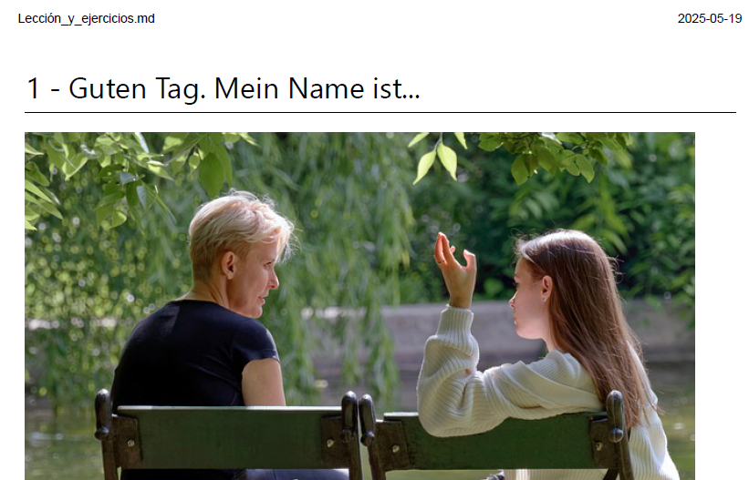

# ⚫🔴🟡 Lección: *Hallo. Meine Name ist...*

Lección teórica y con ejercicios en **PDF**, estructurada siguiendo un formato explicación-práctica. Se trata de la parte más teórica del curso, con imágenes y vídeos para fomentar el aprendizaje. No contiene actividades interactivas, pero sí enlaces a recursos externos para complementar los contenidos. 

## 📚 Estructura desglosada de las lecciones

### Lección 1: Hallo. Meine Name ist...
1.1. **Einführung** (Introducción)
* 1.2. **Grüße** (Saludos)  
  - Estructura sintáctica
  - Personalpronomen (Pronombres)
* 1.4. **Ich komme aus...** (Vengo de...)
  - Verben (Verbos) 
* 1.5. **Persönliche Angaben** (Datos personales)
* 1.6. **Wortschatz+** (Vocabulario)
* 1.7. **Linken** (Enlaces)

### Lección 2: Familie und Freunde
* 2.1. **Wie geht's? - Danke, sehr gut** (¿Cómo estás?)
* 2.2. **Das ist mein Freund...** (Presentar a alguien)
* 2.3. **Zahlen** (Números)
* 2.5. **Linken** (Enlaces)

## ⚙️ Ejecución

<<<<<<< HEAD
Para ejecutarla tan solo tienes que hacer clik en la pestaña "Lecciones (PDF) y se abrirá automáticamente en una nueva pestaña de tu navegador. Desde allí podrás también descargar el archivo.  

## ⏭️ Siguiente lección

Tras completar la lección, te recomiendo que investigues el glosario para descubrir vocabulario nuevo. Allí encontrarás numerosas frases útiles para el día a día así como palabras complementarias subdividas por temáticas. También, una unidad dedicada plenamente a la fonética alemana, con enlaces a recursos útiles para su práctica.  

➡️ [Siguiente: Glosario](../02-glosario/README.md)

## 🗂️ Navegación

- 🔙 [Anterior](../00-presentacion/README.md)
- 🏠 [Índice general](../README.md)
