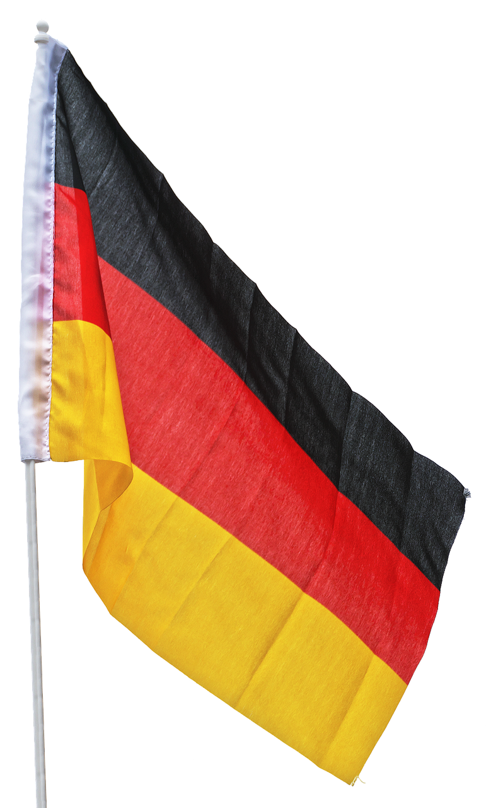

# Introducción
*Wilkommen*!   
En esta pequeña guía aprenderemos algo de fonética alemana (y descubriremos que no gritan todo el tiempo...), así como algunas frases útiles para nuestro día a día. ¡Adelante!

