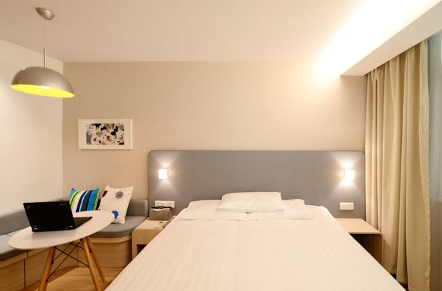
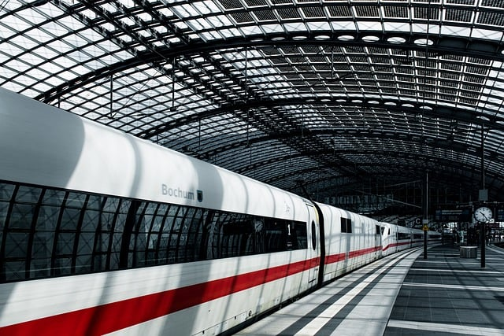
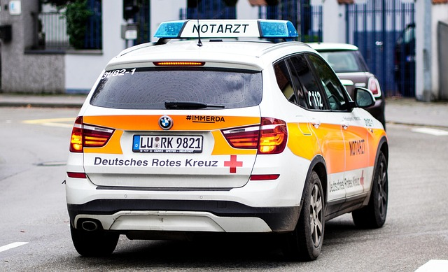

# ✈️Frases útiles

## 🎯 Objetivo
Aprender frases básicas para comunicarse en situaciones comunes al viajar por Alemania.

---

## 🏨 1. En el hotel

| Alemán                                | Español                          |
|--------------------------------------|----------------------------------|
|*Guten Tag, ich habe eine Reservierung*. | Buenas tardes, tengo una reserva. |
|*Wo ist die Rezeption?*                | ¿Dónde está la recepción?        |
|*Wie viel kostet das Zimmer pro Nacht?* | ¿Cuánto cuesta la habitación por noche? |
|*Ich möchte ein Einzelzimmer.*         | Quisiera una habitación individual. |
| *Haben Sie WLAN?*                      | ¿Tienen wifi?                    |

---

## 🍽️ 2. En el restaurante

| Alemán                             | Español                          |
|-----------------------------------|----------------------------------|
| *Die Speisekarte, bitte.*           | La carta, por favor.             |
| *Ich hätte gern ein Wasser.*        | Me gustaría un agua.             |
| *Ich bin Vegetarier(in).*           | Soy vegetariano(a).              |
| *Die Rechnung, bitte.*              | La cuenta, por favor.            |
| *Es war sehr lecker!*              | ¡Estaba muy rico!                |

---

## 🚉 3. En el transporte

| Alemán                                   | Español                          |
|-----------------------------------------|----------------------------------|
| *Wo ist der Bahnhof?*                     | ¿Dónde está la estación de tren? |
| *Wie komme ich zum Flughafen?*            | ¿Cómo llego al aeropuerto?       |
| *Ich möchte ein Ticket nach Berlin.*      | Quiero un billete a Berlín.      |
| *Fährt dieser Bus zum Zentrum?*           | ¿Este autobús va al centro?      |
| *Um wie viel Uhr fährt der Zug ab?*       | ¿A qué hora sale el tren?        |

---

## 🛍️ 4. Compras

| Alemán                               | Español                          |
|-------------------------------------|----------------------------------|
| *Wie viel kostet das?*               | ¿Cuánto cuesta esto?             |
| *Ich schaue nur, danke.*            | Solo estoy mirando, gracias.     |
| *Haben Sie das in einer anderen Größe?* | ¿Lo tiene en otra talla?        |
| *Kann ich mit Karte bezahlen?*       | ¿Puedo pagar con tarjeta?        |

---

## ❓ 5. Emergencias o ayuda

| Alemán                            | Español                          |
|----------------------------------|----------------------------------|
| *Ich habe mich verlaufen.*         | Me he perdido.              |
| *Ich brauche Hilfe.*               | Necesito ayuda.                  |
| *Rufen Sie bitte die Polizei.*     | Llame a la policía, por favor.   |
| *Wo ist die Apotheke?*             | ¿Dónde está la farmacia?         |
| *Gibt es jemanden, der Spanisch spricht?* | ¿Hay alguien que hable español? |

---

## 🧠 Tip: Aprende por bloques temáticos
Organiza tus frases por lugar: hotel, aeropuerto, restaurante. Así las recordarás mejor cuando estés allí.

> “Mit wenig Deutsch kann man viel erreichen!”  
> *¡Con poco alemán se puede lograr mucho!*

