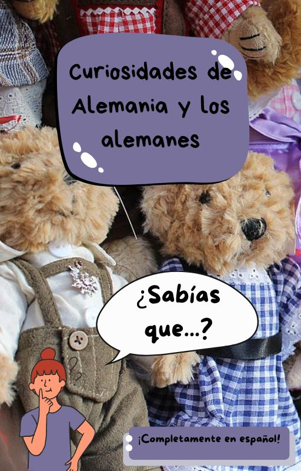

# ⚫🔴🟡 Lección: Curiosidades de Alemania y los alemanes

Pequeño libro sobre cultura y curiosidades dividido en dos secciones: 

1. **Curiosidades del idioma alemán:** se dan una serie de datos sobre el idioma que normalmente son desconocidos a aquellos que se inician por primera vez en la lengua. Se busca fomentar la curiosidad y el aprendizaje, llevandolo más allá de las reglas gramaticales.
2. **Curiosidades sobre Alemania:** serie de datos llamativos sobre el país y su cultura. 

## 📚 Estructura desglosada 

1. 🤔 **Curiosidades del idioma alemán**  
   1.1. Palabras larguísimas
   1.2. Ausrufe!  
   1.3. Idioma más hablado en la UE
   1.4. Palabras intraducibles 
   1.5. No todo se dice igual...
   1.6. Actividades  
2. 👀 **Curiosidades sobre Alemania:** 
   2.1. Límites de velocidad  
   2.2. Oktoberfest 
   2.3. Líder en reciclaje 
   2.4. Madre de la "Fanta" 
   2.5. Actividades
3. 📎 **Apéndice** (aquí se encuentran recursos extra de interés)

## ⚙️ Ejecución

Tan solo tienes que descargarte el archivo ePub. 
**IMPORTANTE**: es necesario tener instalado un lector de archivos ePUB (Adobe no sirve). Te recomiendo *Sigil* o *Calibre*. El primero de ellos también funciona como editor, y el segundo, como librería. **Ambos son software libre, gratuito**, pero puedes usar cualquier otro. 

## ⏭️ Siguiente lección

Finalmente, te propongo un juego ➡️ *Ein neur Anfang in Deutschland*. Lee su readme antes de iniciarlo. 

➡️ [Siguiente: Ein neur Anfang in Deutschland](../04-historia/README.md)

## 🗂️ Navegación

- 🔙 [Lección anterior](../02-glosario/README.md)
- 🏠 [Índice general](../README.md)