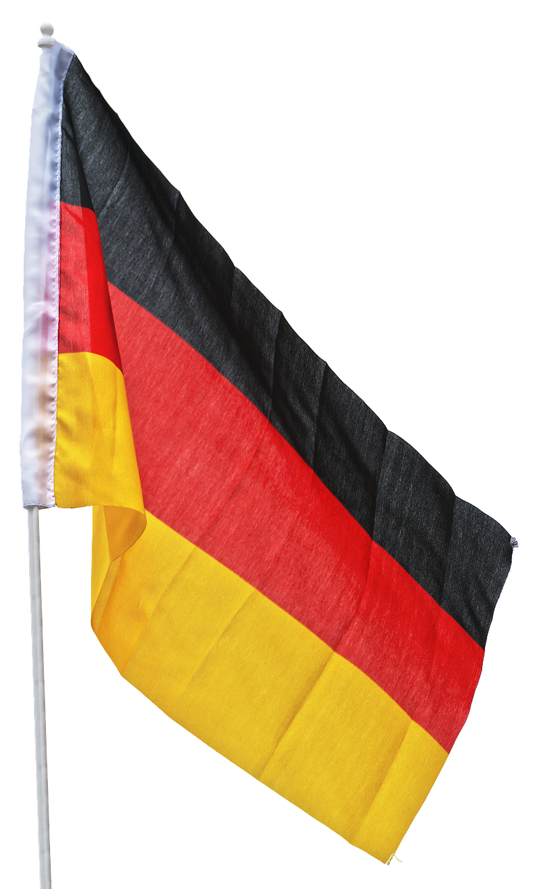

# 🤔 Introducción
Para completar el aprendizaje es necesario saber algo más que reglas gramaticales, por ello, en este libro, encontrarás curiosidades tanto del idioma alemán como del país. Te invito a que consultes los enlaces proporcinados en el apéndice, ya que esto solo es una breve guía. ¡Adelante!

