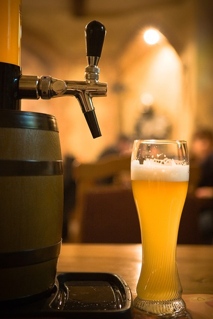
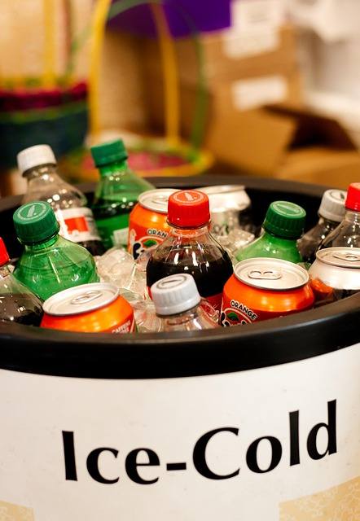

# 🏰 Unidad 2: Curiosidades sobre Alemania

## 🛣️ 1. Las autopistas no siempre tienen límite de velocidad...
Seguro que no es la primera vez que "escuchas" esto. Y es que en Alemania, las conocidad *Autobahn* no tienen un límite general de velocidad (aunque sí una recomendación de no superar los **130 km/h**.) La velocidad media de los automóviles es de 125 km/h. 
> Puedes encontrar más info en: [Deutschland.de](https://www.deutschland.de/es/topic/vida/alemania-y-la-autobahn-limite-de-velocidad-y-realidad)

Hay que tener en cuenta que se trata de carreteras sin cruces con generalmente cuatro carriles por sentido, y no todos los vehículos pueden alcanzar tales velocidades (los camiones no deben sobrepasar los 80 km/h). 

## 🍺 2. Oktoberfest 

- El Oktoberfest, la conocidíisima "fiesta de la cerveza" se llama literalmente "festival de octubre", pero este, en la ciudad de Múnich, comienza en **septiembre** y termina a inicios de octubre. Se celebró por primera vez en 1810, y originalmente sí tenía lugar en octubre, pero se adelantó debido de las temperaturas más cálidad del noveno mes. 
- Todas las cervezas que se consumen son originales de Münich, la más famosa es conocida como la cerveza de Baviera y cuenta con solo tres ingredientes: agua, cebada y lúpulo. 
- El festival tan solo comienza cuando el alcalde grita **O'zapft is!** (algo así como "¡Abierto!") y ofrece la primera cerveza al Ministro-Presidente del Estado de Baviera. [Aquí](https://www.youtube.com/watch?v=gjcQmLSPeJw) tienes un vídeo de YouTube para verlo.

## ♻️ 3. Alemania es líder en reciclaje

En Alemania existe desde el año 2003 un sistema llamado *Pfand* que consiste en pagar 25 céntimos más al comprar una botella de vidrio, plástico o latas de aluminio. Dicho dinero es devuelto cuando el consumidor devuelve el envase vacío a una máquina de reciclaje. Pueden recibirlo en efectivo o como un vale para compras. Este sistema (conocido como SDDR: depósito, devolución y retorno), también se ha extendido a países como Austria, Dinamarca o Finlandia.
Hoy en día, en Alemania tiene una tasa de retorno del 98.5%, lo que implica una gran tasa de éxito entre la población.

## 🥤 4. Madre de la conocida "Fanta"
¿Sabías que la fanta de naranja que todos conocemos no tiene su origen en EEUU? Durante la Segunda Guerra Mundial era complicado importar todos los ingredientes necesarios para crear la bebida "Coca-Cola" ya que EEUU cerró el comercio con Alemania. Por ello, en 1940, crearon la que conocemos como la actual Fanta de naranja. 

> 💡 ¿Sabes de donde viene el nombre de "Fanta"? Se cree que es de la palabra "*fantasie*" o de "*fantastisch*", pero no se tiene muy claro. 

Si te apetece indagar más en el tema, te dejo [aquí](https://historia.nationalgeographic.com.es/a/fanta-origen-fantastico-este-popular-refresco_16622) un enlace a un artículo del National Geographic. 

---

## ✏️ Actividades – Unidad 2

### 🌍 Actividad 1: Selección múltiple

¿Cuál de las siguientes afirmaciones es **incorrecta**?

A) La Fanta se originó en EEUU.  
B) El Oktoberfest comienza en octubre.  
C) La velocidad media en las *autobahn* es de 125 km/h.  
D) Alemania tiene un sistema de reciclaje avanzado.

---
### 🧳 Actividad 2: Imagina y responde

**¿Qué lugar o costumbre alemana te gustaría conocer o experimentar y por qué?**  
(Escribe tu respuesta en 2 o 3 frases)

