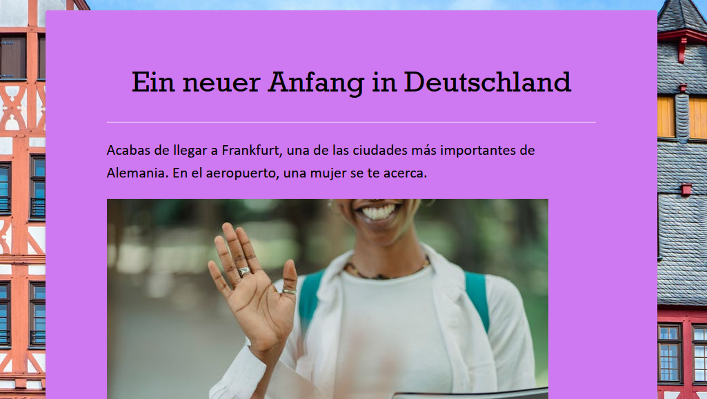

# ⚫🔴🟡 Ein neuer Anfang in Deutschland

Historia interactiva con [Twine](https://twinery.org/). Se trata de una aplicación de ordenador y web que permite la creación de historias o juegos interactivos. En este caso el/la protagonista de la historia eres tú. Como estudiante recién llegado a la ciudad de Frankfurt, tendrás que aprender a deselvolverte para poder llegar al final. Se trataran los contenidos vistos en la **lección**, pero dándole un toque más atrevido. 
No tiene puntuación final, es solo para que te aprendas divirtiéndote. 

## ⚙️ Ejecución

Puedes ejecutar la historia haciendo doble click en el archivo html. Se abrirá de forma automática en otra pestaña de tu navegador. Si lo prefieres, puedes descargarte la aplicación de Twine y ejecutar el archivo twee. 

## 🗂️ Navegación

Hasta aquí el final de este mini-curso para inciarse en alemán. Siempre puedes volver a repasar los contenidos:

- 🔙 [Presentación](../00-presentacion/README.md)
- ✍🏽 [Lección](../01-leccion/README.md)
- 🔠 [Glosario](../02-glosario/README.md)
- 🤔 [Curiosidades](../03-curiosidades/README.md)
- 🏠 [Índice general](../README.md)

