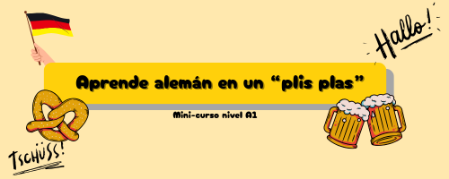

# ⚫🔴🟡 Bienvenido/a a *Aprende alemán en un "plis plas"*

Un mini-curso para tomar un primer contacto con la lengua germana, desarrollado de forma amena y cercana, usando tan solo unos pocos recursos.

## 🎯 Objetivo global
* Adquirir conocimientos mínimos de la lengua alemana.
* Permitir al estudiante defenderse en situaciones comunes. 

    ### ➡️ Objetivos específicos 
    * Saludar y presentarse
    * Reconocer los pronombres personales
    * Saber conjugar los primeros verbos
    * Dar datos personales
    * Decir cómo te encuentras
    * Saber contar hasta 30
    * Presentar a amigos y familia
    * Conocer la fonética
    * Incentivar la curiosidad y el aprendizaje cultural 

## 📁 Contenido del repositorio
* **Presentación** hecha con Reveals.js (contenidos, requisitos y créditos)
* **Lección** con explicaciones y ejercicios prácticos en PDF.
* **Glosario** ePub: fonética y frases útiles.
* **Guía** ePub sobre curiosidades: de la lengua alemana y del país.
* **Historia interactiva** en Twine
* 
## 👨👩‍🦰 Destinatarios y requisitos previos
Este mini-curso está enfocado a cualquier persona a partir de 14 años que tenga interés por el idioma alemán. Al tratarse de un curso inicial **no son necesarios conocimientos previos de la lengua**, pero **sí se requiere de un mínimo de manejo tecnológico**: uso del navegador, funcionamiento de GitHub, uso de enlaces externos, manejar ePubs y PDFs. 

## ⏲️ Duración
Se trata de un curso muy breve, la duración estimada del mismo es de **120 minutos** aproximadamente. 

  
## 🏅 Certificación 
Este mini-curso no posee certificación. Se trata de un recurso gratuito creado para fomentar el interés en la lengua alemana. 

## 🖱️ Cómo usar el curso
El orden a seguir recomendado es el siguiente:

1. Lee la **presentación** hecha con Reveals.js, te dará las claves sobre la estructura del curso.
2. Completa la **lección** en PDF para adquirir los conocimientos mínimos necesarios.
3.  Lee y realiza las actividades del **glosario** y del **libro de curiosidades** para complementar la información.
4. Finalmente, te recomiendo la **Historia interactiva** en Twine como breve repaso y colofón del mini-curso.
   
> En cualquier caso, puedes seguir el orden que más te convenga. En cada recurso encontrarás más detalles y explicaciones de cómo ejecutarlo. ¡Espero que lo disfrutes! 🤗
